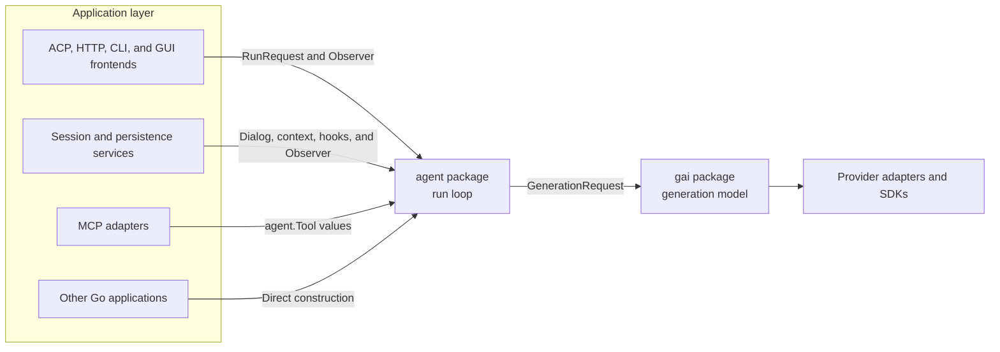
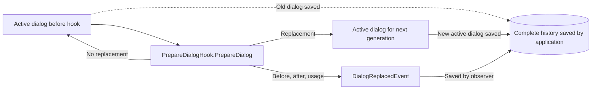
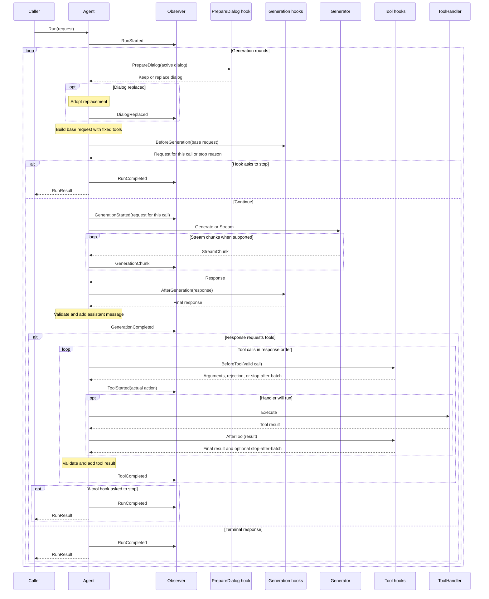
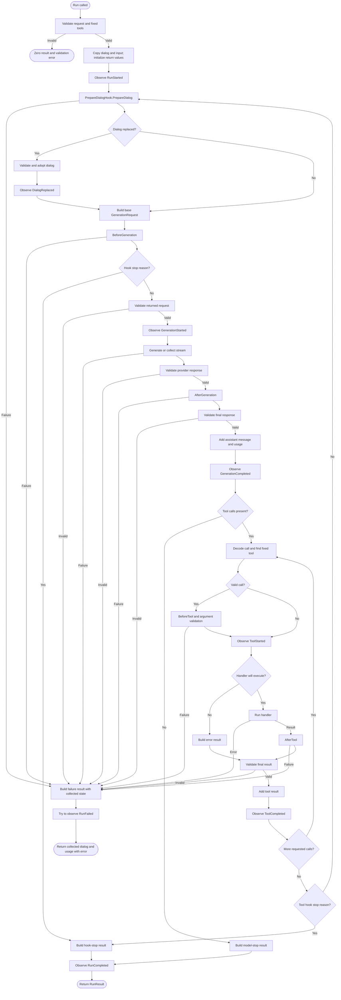

# Agent package design

Status: Draft for discussion

## Summary

The `agent` package will provide a reusable loop for running tool-using Agents on top of `gai`. It will send a complete `gai.GenerationRequest`, receive one assistant response, run requested tools, append tool results, and continue until the model or a hook stops.

The package will use `gai` values directly. It will not define competing message, block, response, finish-reason, option, usage, tool-schema, or stream-chunk types.

The main rule is:

> The agent owns what happens during one run. The application owns where the run came from and where its state goes afterward.

An Agent is fixed configuration and behavior, not a session. A run receives an active dialog and one new input message, sends ordered events, and returns the dialog that the caller may save or pass to a later run. A small set of typed hooks may change decisions inside the run. Observers report what happened but cannot replace requests, tool calls, results, or dialog.

## Goals

- Provide a small public Go package that applications can construct directly.
- Use `gai.GenerationRequest` values directly instead of storing request data on generators.
- Support chat, coding, background, and multi-agent applications without putting frontend behavior in the loop.
- Keep tool definitions shown to the model next to the handlers that execute them.
- Report streaming output while adding only completed `gai.Response` values to the dialog.
- Return the dialog and usage collected before an operation fails.
- Keep lasting dialog changes separate from changes made for one model call.
- Provide a small, typed set of request and tool hooks instead of a dynamic system for arbitrary hooks.
- Let hooks stop a run normally without limits imposed by the package.
- Call read-only observers synchronously and in order.
- Let one `Agent` run safely for several callers at the same time.
- Make the loop testable with scripted generators and ordinary Go functions.

## Non-goals

The initial package will not provide:

- session identity, persistence, databases, or a global session manager;
- ACP, HTTP, CLI, GUI, JSON-RPC, or other frontend protocols;
- provider credentials, environment loading, or generator construction;
- MCP connection setup or pooling;
- dynamic tool registration or per-run tool-set changes;
- coding-specific prompts, tools, skills, working directories, or approval UIs;
- provider retry policy, which belongs in generator wrappers;
- package-defined generation, tool-execution, token, cost, or time limits;
- tool-specific authorization, retries, or making repeated calls safe;
- a multi-agent scheduler, graph language, or supervisor;
- a dynamic system for registering arbitrary hooks throughout the run.

The first release has only the typed hooks listed in this document. Applications or later packages can add sessions, storage, crash recovery, and broader customization around `agent`.

## Dependency direction



`agent` imports the root `github.com/spachava753/gai` package and the Go standard library. It does not import provider SDKs, generated provider clients, persistence packages, frontend protocols, or application configuration.

A future repository layout may include:

```text
agent/              Public agent loop
agent/agenttest/    Scripted generators, observers, hooks, and tool fixtures
agent/harness/      Possible future sessions, storage, and crash recovery
adapter/mcp/        MCP definitions and calls adapted to agent.Tool
```

Package boundaries are sufficient. A separate module is unnecessary unless independent versioning or dependency weight creates a concrete need.

## Current GAI API

This design targets the current GAI API rather than the older CPE sketch:

```go
type GenerationRequest struct {
    Model        string
    Instructions gai.Message
    Dialog       gai.Dialog
    Tools        []gai.Tool
    Options      gai.GenerationOptions
}

type Generator interface {
    Generate(context.Context, gai.GenerationRequest) (gai.Response, error)
}

type StreamingGenerator interface {
    Stream(context.Context, gai.GenerationRequest) iter.Seq[gai.StreamChunk]
}

type TokenCounter interface {
    Count(context.Context, gai.GenerationRequest) (uint, error)
}
```

The actual declarations live in package `gai`; the package name is included here to show which types come from it.

The request already contains the model, system `Message`, dialog, tools for that call, and map-backed options. The agent must not mutate a generator to install instructions or tools.

`gai.ToolCallInput` is currently encoded in a `gai.ToolCall` block and stores decoded parameters as `map[string]any`. Until GAI exposes a raw-argument tool-call value, agent events and handlers will carry both the original block and decoded input.

## Who owns what

### Agent

An `Agent` is an immutable definition containing:

- a `gai.Generator`;
- a model identifier;
- optional system instructions;
- executable tools;
- optional context and hook behavior.

Construction validates and copies these values. It never registers tools on the generator. The tool set remains fixed for the lifetime of the Agent. One Agent may run for several callers at the same time when its generator, hooks, and tool handlers are safe for concurrent use.

### Run

A run starts with a prior dialog plus one new input message and proceeds one step at a time. It may make several generation calls and run several tools. It ends when the model or a hook stops, the context is canceled, or an operation fails.

Separate runs may execute concurrently. Within one run, state changes, hook calls, and events happen in one defined order.

### Session

A session belongs to the application. It may keep an ID, saved state, usage across runs, the active dialog, complete history, the selected Agent, and a lock that prevents conflicting work. The agent loop accepts and returns values and does not require a session type.

### Active dialog and complete history

The active dialog is the `gai.Dialog` sent to the next model call. Complete history is the application's saved record of inputs, generations, tool results, and dialog replacements.

The `PrepareDialog` hook may replace the active dialog. Replacement does not delete the old dialog. The loop sends an event with both versions, and the application decides how to save their history.



## Proposed API

The first implementation should use an API close to this shape:

```go
package agent

import (
    "context"

    "github.com/spachava753/gai"
)

type Config struct {
    Generator        gai.Generator
    Model            string
    Instructions     gai.Message
    Tools            []Tool
    PrepareDialog    PrepareDialogHook
    BeforeGeneration BeforeGenerationHook
    AfterGeneration  AfterGenerationHook
    BeforeTool       BeforeToolHook
    AfterTool        AfterToolHook
    ContextWindow    uint
}

func New(config Config) (*Agent, error)

type RunRequest struct {
    Dialog  gai.Dialog
    Input   gai.Message
    Options gai.GenerationOptions
}

type RunResult struct {
    Dialog            gai.Dialog
    StopReason        StopReason
    ModelFinishReason gai.FinishReason
    Usage             gai.Metadata
}

func (a *Agent) Run(
    ctx context.Context,
    request RunRequest,
    observer Observer,
) (RunResult, error)
```

Names may change. The behavior below is what matters.

### Configuration rules

`Config.Generator` and `Config.Model` are required. A non-empty `Config.Instructions` must be a valid `gai.System` message. The constructor validates the fixed tool definitions, duplicate names, handlers, and hook settings that the Agent stores.

`Config.PrepareDialog`, `Config.BeforeGeneration`, `Config.AfterGeneration`, `Config.BeforeTool`, and `Config.AfterTool` are optional. A nil value does nothing. Each field stores one hook. To run several functions at the same point, an application supplies one hook that calls them in its chosen order and combines their results. Separate runs may call hooks at the same time, so their implementations must support concurrent use.

The model is agent configuration because an agent defines behavior. `BeforeGeneration` may select another model for one call without changing the configured model used for the next request. An application that needs a lasting model change can construct another agent or choose an agent outside this loop.

`Config.Tools` is the Agent's complete executable tool set. The constructor copies and validates it. Runs and hooks cannot add, remove, replace, or reorder tools. An application that needs a different tool set constructs another Agent.

A nil `PrepareDialog` hook means no lasting dialog replacement. `ContextWindow` tells that hook the model's known context-window size and may be zero when that size is unknown.

### Run request rules

`RunRequest.Dialog` is the prior active dialog. `Input` is one new, non-empty `gai.User` message. A single message may contain several text or multimodal blocks. The loop validates and copies both values, then appends `Input` before the first generation. It does not modify the caller's dialog or message.

`Options` is read-only for the duration of `Run`. The loop reuses the same map in every base generation request and never modifies it. The caller must not modify the map until `Run` returns. A change made by `BeforeGeneration` for one call must use a separate map and is discarded before the next generation.

The first implementation supports exactly one candidate and rejects `gai.GenerationOptionCandidateCount` values other than one.

The `context.Context` passed to `Run` is also passed to every hook, the observer, the generator, and tool handlers. Applications can use typed context values for trace IDs, tenant identity, authorization data, or other values needed during the run. The Agent defines no run ID or metadata map.

Context values should describe this call. If hooks and observers deliberately share a mutable value through the context, the application must protect that value when concurrent access is possible.

### Run result rules

`Dialog` is the active dialog to pass to a later run. It begins as the prior dialog plus `Input`, then reflects any lasting replacement and any assistant messages or tool results added by the loop.

`Usage` is the total standard usage from provider responses added to the dialog and work reported by `PrepareDialog`. Provider-specific fields with no defined addition rule remain available only through observer events.

`StopReason` says why the Agent returned normally. The package defines `StopReasonModel`; a hook may return another non-empty value such as `"cost_budget"` or `"task_complete"`:

```go
type StopReason string

const StopReasonModel StopReason = "model"
```

`ModelFinishReason` is meaningful only when `StopReason` is `StopReasonModel`. It preserves the terminal response's `gai.FinishReason`, such as stop, length, or content filtering. A hook-requested stop leaves it as `gai.Unknown` because the most recent model response did not end the Agent loop.

Completed responses, messages produced during the run, provider metadata, and execution counts are available through observer events. They are intentionally absent from `RunResult`.

A normal model or hook stop returns a nil error. Cancellation, invalid generator behavior, observer failure, hook failure, and failures while calling a generator or tool return the dialog and usage collected so far with a non-nil error. Request validation failures happen before a run starts and return a zero result.

## Executable tools

A tool pairs the `gai.Tool` definition sent to the model with the application code that runs it:

```go
type Tool struct {
    Definition gai.Tool
    Handler    ToolHandler
}

type ToolHandler interface {
    Execute(context.Context, ToolRequest) (gai.Message, error)
}

type ToolRequest struct {
    Block gai.Block
    Call  gai.ToolCallInput
}
```

`Block` is the original call produced by the model, including its ID and extra fields. `Call` is the decoded input. Keeping both avoids another stored tool-call type and keeps provider data available to observers and adapters.

A later helper can adapt `gai.ToolCallback` and `gai.ToolCallBackFunc` to `ToolHandler`. A typed helper can combine `gai.GenerateSchema` with argument decoding. These helpers must use the same execution path as ordinary tools.

### Tool validation and execution

The constructor rejects:

- empty or duplicate tool names;
- reserved names already rejected by GAI providers;
- nil handlers;
- invalid static definitions that GAI can validate without a provider call.

For each response, the loop decodes `gai.ToolCall` blocks in order. A valid call ID must be unique within the run.

Unknown tool names, malformed parameters, and argument validation failures are reported to the model when a call ID is available. The loop creates a `gai.ToolResultMessage`, sets `ToolResultError`, and lets the model respond on the next generation.

A handler returns one of two outcomes:

- A `gai.ToolResult` message and nil error represents success or an expected failure that the model should see. The handler sets `ToolResultError` for the latter.
- A non-nil Go error means the handler could not complete reliably. The run stops.

The loop validates the returned message and sets every result block's ID to the originating call ID. It never trusts a handler to associate results with another call.

Multiple calls run one at a time in response order. Parallel execution is deferred until the design defines cancellation, result order, what happens when only some calls succeed, and behavior for tools that change external state.

## Hooks

The loop calls each hook and waits for its answer before continuing. Hooks are separate from observers because a hook may change or reject work, while an observer only receives a report of what happened.

The first release has five hooks:

```go
type RunStatus struct {
    GenerationCalls uint
    ToolExecutions   uint
    Usage            gai.Metadata
}

type PrepareDialogHook interface {
    PrepareDialog(
        context.Context,
        PrepareDialogRequest,
    ) (PrepareDialogDecision, error)
}

type PrepareDialogRequest struct {
    Generation    uint
    Model         string
    Instructions  gai.Message
    Dialog        gai.Dialog
    Tools         []gai.Tool
    Options       gai.GenerationOptions
    ContextWindow uint
    Counter       gai.TokenCounter
    Status        RunStatus
}

type PrepareDialogDecision struct {
    Dialog   gai.Dialog
    Replaced bool
    Usage    gai.Metadata
}

type BeforeGenerationHook interface {
    BeforeGeneration(
        context.Context,
        BeforeGenerationRequest,
    ) (BeforeGenerationDecision, error)
}

type BeforeGenerationRequest struct {
    Generation uint
    Request    gai.GenerationRequest
    Status     RunStatus
}

type BeforeGenerationDecision struct {
    Request    gai.GenerationRequest
    StopReason StopReason
}

type AfterGenerationHook interface {
    AfterGeneration(
        context.Context,
        AfterGenerationRequest,
    ) (gai.Response, error)
}

type AfterGenerationRequest struct {
    Generation uint
    Request    gai.GenerationRequest
    Response   gai.Response
    Status     RunStatus
}

type BeforeToolHook interface {
    BeforeTool(
        context.Context,
        BeforeToolRequest,
    ) (BeforeToolDecision, error)
}

type BeforeToolRequest struct {
    Generation uint
    ToolIndex  uint
    Block      gai.Block
    Call       gai.ToolCallInput
    Definition gai.Tool
    Status     RunStatus
}

type BeforeToolDecision struct {
    Parameters     map[string]any
    Reject         bool
    Reason         string
    StopAfterBatch StopReason
}

type AfterToolHook interface {
    AfterTool(
        context.Context,
        AfterToolRequest,
    ) (AfterToolDecision, error)
}

type AfterToolRequest struct {
    Generation uint
    ToolIndex  uint
    Block      gai.Block
    Call       gai.ToolCallInput
    Definition gai.Tool
    Result     gai.Message
    Status     RunStatus
}

type AfterToolDecision struct {
    Result         gai.Message
    StopAfterBatch StopReason
}
```

`RunStatus` describes work already added to the active dialog. The current response is not included while `AfterGeneration` runs, and the current tool execution is not included while `AfterTool` runs. These counters let hooks make their own limit decisions. `Run` does not return them, and the package enforces no limits on its own.

The package should also provide function adapters for these interfaces, following `ObserverFunc` and the existing GAI callback patterns.

### Hook catalog

| Hook | When it runs | What it may change | What happens on error |
|---|---|---|---|
| `PrepareDialogHook.PrepareDialog` | Before the base request is built | The active dialog used now and returned from the run | The run stops before another provider call |
| `BeforeGenerationHook.BeforeGeneration` | After `PrepareDialog`, immediately before `GenerationStartedEvent` | The request for this provider call only, or a normal hook stop | The run stops before the provider call |
| `AfterGenerationHook.AfterGeneration` | After the generator returns a complete response and before the response enters the dialog | The response, including message, block, and response extra fields | The run stops before the response enters the dialog |
| `BeforeToolHook.BeforeTool` | After the call, tool, and original arguments are valid; before `ToolStartedEvent` | The argument map, rejection, and whether to stop after the batch | The run stops before the handler |
| `AfterToolHook.AfterTool` | After a handler returns a result for the model and before it enters the dialog | The tool-result message and whether to stop after the batch | The run stops before the result enters the dialog |

The first release has no hooks for run start, run end, stream chunks, or failures. Observers report those events without changing them. Generator wrappers handle provider retries. Generator or HTTP transport wrappers change provider-specific headers and raw request bodies.

### Changes for one generation call

`BeforeGeneration` receives the base request after any lasting dialog replacement. When `StopReason` is empty, the returned request is validated, sent to the generator once, and exposed as `GenerationStartedEvent.Request`. The next generation starts again from Agent configuration, run options, fixed tools, and the active dialog.

A non-empty `StopReason` asks the loop to return normally without another provider call. The returned request is ignored, `ModelFinishReason` remains `gai.Unknown`, and the loop sends `RunCompletedEvent`. `StopReasonModel` is reserved for a terminal model response and is invalid as a hook stop reason.

The hook may change the model, instructions, dialog, or options for that call. The returned tools must exactly match the Agent's configured tools. A changed `Dialog` affects only that provider call. It does not replace the active dialog and does not appear in `RunResult.Dialog` except through the assistant response produced from it.

This supports retrieved documents, temporary filtering, current-time data, and fields needed for one call. The hook must keep any temporary dialog internally consistent and within the provider's size limit. `PrepareDialog` runs first. If `BeforeGeneration` adds more content afterward, `PrepareDialog` does not count that content again.

The hook must treat its input as read-only. It may return the same request unchanged. If it changes options, messages, blocks, or extra fields, it must allocate new maps and slices so the normal run values remain unchanged.

### Generation result changes

`AfterGeneration` receives the exact request and complete response before the response enters the active dialog or reaches `GenerationCompletedEvent`. It may change response-level extra fields and any candidate message or block fields. It must preserve `FinishReason` and `UsageMetadata`; those report what the provider did and feed the run result. The loop validates and copies the returned response, then adds its assistant message and usage. The observer sees the returned response rather than the provider's unmodified value.

### Tool hook rules

`BeforeTool` runs only for a known tool whose original arguments passed validation. A nil `BeforeToolDecision.Parameters` keeps the original map; a non-nil map replaces it, including a non-nil empty map. The loop copies and validates replacement arguments against the fixed definition before doing anything else. The hook cannot change the call ID or tool name. `Reject` and non-nil `Parameters` cannot be returned together.

`Reject` prevents the handler from running. The loop creates a failed tool result for the model using `Reason`, or a stable package default when `Reason` is empty. A rejection does not increment `RunStatus.ToolExecutions`.

`AfterTool` runs only when the handler returned a `gai.Message` and nil error. It sees the arguments actually used and the handler's result. The loop validates `AfterToolDecision.Result`, forces result block IDs to the original call ID, and then adds it to the dialog. It does not run for unknown tools, malformed calls, before-hook rejections, error results created by the loop, or handler errors.

A non-empty `StopAfterBatch` from either tool hook asks the loop to stop normally after every tool call in the assistant message has a corresponding result. `StopReasonModel` is invalid here because the model did not end the loop. The first non-empty reason in tool-call order wins. Waiting until the batch is complete keeps the returned dialog valid if it is sent to a model later.

A hook error or invalid hook output stops the run instead of becoming a tool failure shown to the model. In particular, an error from a permission hook stops before the handler runs. The dialog and usage collected so far are returned, and `RunFailedEvent.Phase` identifies the failed hook.

## Observers

The observer receives synchronous, read-only updates from one run:

```go
type Observer interface {
    Observe(context.Context, Event) error
}

type ObserverFunc func(context.Context, Event) error

type Event struct {
    Sequence uint64
    Payload  EventPayload
}

type EventPayload interface {
    Kind() EventKind
    eventPayload()
}

type EventKind string

const (
    EventKindRunStarted          EventKind = "run_started"
    EventKindDialogReplaced      EventKind = "dialog_replaced"
    EventKindGenerationStarted   EventKind = "generation_started"
    EventKindGenerationChunk     EventKind = "generation_chunk"
    EventKindGenerationCompleted EventKind = "generation_completed"
    EventKindToolStarted         EventKind = "tool_started"
    EventKindToolCompleted       EventKind = "tool_completed"
    EventKindRunCompleted        EventKind = "run_completed"
    EventKindRunFailed           EventKind = "run_failed"
)
```

The payload interface accepts only event types defined by this package. Applications can handle those events but cannot add new package event kinds. An observer cannot return replacement data or change a decision. The loop gives observers copies of slices and top-level maps that could otherwise change run state. Values nested inside `ExtraFields` remain read-only because GAI cannot copy arbitrary Go values. `Event.Kind` may delegate to `Payload.Kind` for convenient switches.

`Sequence` begins at one and has no gaps within a run. Events from separate runs have no shared order. `Observe` receives the same `context.Context` passed to `Run`, so a shared observer can read values such as a request or trace ID from it.

The loop calls one run's observer synchronously and never calls it concurrently. A slow observer delays generation streaming, tools, and later model calls. A nil observer discards events.

An observer error stops the run. After a delivery fails, the loop starts no later provider call or tool handler. This lets an application require each event to be saved before work continues, without letting the observer rewrite that work. Metrics, logging, and UI observers that should never stop a run can use a wrapper that records or discards observer errors.



Every arrow from the agent to the observer is synchronous. If a started event fails, the provider call or tool handler does not begin. If a completed event fails, `Run` returns the state that it added before the event. Hook calls are not observer events. Their outputs appear in `DialogReplacedEvent`, `GenerationStartedEvent`, `GenerationCompletedEvent`, `ToolStartedEvent`, and `ToolCompletedEvent`.

### Event payloads

The first implementation should define payloads close to:

```go
type RunStartedEvent struct {
    Model        string
    Instructions gai.Message
    Dialog       gai.Dialog
    Input        gai.Message
    Tools        []gai.Tool
    Options      gai.GenerationOptions
}

type DialogReplacedEvent struct {
    Generation uint
    Before     gai.Dialog
    After      gai.Dialog
    Usage      gai.Metadata
}

type GenerationStartedEvent struct {
    Generation uint
    Request    gai.GenerationRequest
}

type GenerationChunkEvent struct {
    Generation uint
    Chunk      gai.StreamChunk
}

type GenerationCompletedEvent struct {
    Generation uint
    Response   gai.Response
}

type ToolStartedEvent struct {
    Generation uint
    ToolIndex  uint
    Block      gai.Block
    Call       *gai.ToolCallInput
    Definition *gai.Tool
    WillExecute bool
    Reason      string
}

type ToolCompletedEvent struct {
    Generation uint
    ToolIndex  uint
    Block      gai.Block
    Call       *gai.ToolCallInput
    Definition *gai.Tool
    Result     gai.Message
    Executed   bool
}

type RunCompletedEvent struct {
    Result RunResult
}

type RunFailedEvent struct {
    Result RunResult
    Phase  RunPhase
    Err    error
}
```

`Generation` and `ToolIndex` are one-based.

`ToolStartedEvent` is sent for every requested tool call that reaches tool handling, including calls for which the loop creates an error result. `WillExecute` is true only when the handler will run immediately after successful event delivery. `Reason` explains an unknown tool, malformed call, hook rejection, or another path that skips the handler; it is empty when the handler will run. `ToolCompletedEvent.Executed` reports whether the handler ran.

`Call` is nil when the original block cannot be decoded. When `BeforeTool` replaced parameters, `Call` contains the validated parameters that will be used. `Definition` is nil when the requested tool is unknown; otherwise it is the Agent's fixed definition. The original provider block remains available in both events.

`RunPhase` identifies where a started run failed:

```go
type RunPhase string

const (
    RunPhasePrepareDialogHook     RunPhase = "prepare_dialog_hook"
    RunPhaseBeforeGenerationHook RunPhase = "before_generation_hook"
    RunPhaseGeneration           RunPhase = "generation"
    RunPhaseAfterGenerationHook  RunPhase = "after_generation_hook"
    RunPhaseValidation           RunPhase = "validation"
    RunPhaseBeforeToolHook       RunPhase = "before_tool_hook"
    RunPhaseTool                 RunPhase = "tool"
    RunPhaseAfterToolHook        RunPhase = "after_tool_hook"
    RunPhaseObserver             RunPhase = "observer"
    RunPhaseCancellation         RunPhase = "cancellation"
    RunPhaseInternal             RunPhase = "internal"
)
```

### When each event is sent

| Event | Exactly when it is sent | State visible at delivery |
|---|---|---|
| `RunStartedEvent` | After request and tool validation, input copying, and preparation of the initial `RunResult`; before `PrepareDialog` or any other hook | Starting dialog, input message, configured model and instructions, fixed tools, and run options |
| `DialogReplacedEvent` | Only when `PrepareDialog` returns `Replaced: true`, after the replacement is validated and adopted; before `BeforeGeneration` | Old dialog, new active dialog, and hook usage |
| `GenerationStartedEvent` | After the base request is built, `BeforeGeneration` chooses to continue, and its returned request is validated; immediately before calling the generator | The exact request that will be sent once |
| `GenerationChunkEvent` | Once for every chunk read from a streaming generator, before the complete response is assembled | The raw chunk, including a chunk carrying an error; no assistant message has entered the active dialog |
| `GenerationCompletedEvent` | After `AfterGeneration` returns and the response and single assistant candidate are validated; after their message and usage enter the run state, but before terminal handling or tool handling | The final response, including hook changes |
| `ToolStartedEvent` | Once for each requested tool call that reaches handling, after decode, lookup, validation, and any applicable `BeforeTool` decision; immediately before the handler or a result created by the loop | Original block, actual call and fixed definition when available, whether the handler will execute, and the reason when it will not |
| `ToolCompletedEvent` | After the handler and `AfterTool` finish, or after the loop creates a result; after the final result is validated and added to the active dialog | The final result shown to the model and whether the handler ran |
| `RunCompletedEvent` | After a model or hook stop has produced the final `RunResult`; immediately before a successful return | The complete result that `Run` will return |
| `RunFailedEvent` | After a started run fails and the loop has prepared the result as far as possible; no later provider call or tool handler follows | The dialog and usage collected so far, failure phase, and error |

Request validation failures happen before `RunStartedEvent` and produce no events. A failure in the observer itself may prevent `RunFailedEvent` from reaching that observer. Hook calls have no separate observer events; their actual outputs appear in the next event listed above.

### Events for saved state and work in progress

Events that describe state already added by the loop are useful when an application saves a run:

- `RunStartedEvent` records input and the actual starting configuration.
- `DialogReplacedEvent` records an active-dialog replacement.
- `GenerationCompletedEvent` records one validated provider response.
- `ToolCompletedEvent` records one validated tool result, whether it came from a handler or the loop.
- `RunCompletedEvent` and `RunFailedEvent` record how the run ended.

`GenerationStartedEvent`, `GenerationChunkEvent`, and `ToolStartedEvent` describe work in progress. They are useful when diagnosing a crash or deciding how to recover, but they do not mean that a provider response or tool result entered the dialog.

These events are Go values passed inside the process. An application that saves them must define and version its own file or database format, especially for `error`, usage, `ExtraFields`, and `Block.Content`.

### Update state before completed events

For completed operations, the loop updates the values that `Run` would return before delivering the event:

- A validated response's assistant message enters `RunResult.Dialog` and its standard usage enters `RunResult.Usage` before `GenerationCompletedEvent`.
- A validated tool result enters `RunResult.Dialog` before `ToolCompletedEvent`.
- A dialog replacement becomes the active `RunResult.Dialog` before `DialogReplacedEvent`.

If the observer rejects a completed event, `Run` returns the updated dialog and usage with the observer error. It does not try to undo the update because an earlier observer called by a wrapper may already have saved the event.

Started events occur before a provider call or tool handler, so rejecting them prevents that work.

## Generation and streaming

Before each model call, the loop builds a base request from Agent configuration, the active dialog, and the run options:

```go
gai.GenerationRequest{
    Model:        agent.model,
    Instructions: agent.instructions,
    Dialog:       activeDialog,
    Tools:        agent.definitions,
    Options:      request.Options,
}
```

The base request reuses the read-only options map and fixed tool definitions. `BeforeGeneration` may return it unchanged, return a request with different input or options for this call, or ask the loop to stop normally. The loop validates the returned request, sends `GenerationStartedEvent` with that exact value, and passes it to the generator once. A dialog returned by this hook does not replace `activeDialog`. Only `PrepareDialog` can do that.

If the generator implements `gai.StreamingGenerator`, the agent should prefer streaming. It can wrap the stream to forward every `gai.StreamChunk` to the observer, then use `gai.StreamingAdapter` to produce the completed response. This avoids duplicating block compression, tool-call assembly, metadata extraction, and extra-field merging.

A stream chunk with `Err` fails generation. Chunks may already have reached observers, but no chunk enters the active dialog. Only a completed response can enter the dialog.

The loop validates the provider response, passes it through `AfterGeneration` when configured, validates the returned response, and then adds its assistant message and usage. `GenerationCompletedEvent` contains the response returned by the hook.

Non-streaming generators produce no chunk events. The loop requires exactly one candidate. An application that requests several candidates can call GAI directly and choose one before continuing the agent run.

## Run flow

A normal run follows these steps:

1. Validate the request, validate the Agent's fixed tools, copy the starting dialog and input, and initialize the values that `Run` will return.
2. Send `RunStartedEvent`.
3. Call `PrepareDialog` with the active dialog.
4. If the hook replaces the dialog, validate and adopt it, then send `DialogReplacedEvent`.
5. Build the base `gai.GenerationRequest` using the fixed tools and read-only run options.
6. Call `BeforeGeneration` when configured.
7. If the hook returns a stop reason, build the result, send `RunCompletedEvent`, and return without another provider call.
8. Validate the request returned by the hook, send `GenerationStartedEvent`, and call the generator, forwarding every stream chunk through `GenerationChunkEvent`.
9. Validate the complete provider response, call `AfterGeneration`, and validate the returned response.
10. Add the assistant message and usage, then send `GenerationCompletedEvent`.
11. If the response is terminal, set `StopReasonModel` and `ModelFinishReason`, send `RunCompletedEvent`, and return.
12. Decode requested tool calls in response order and classify unknown or malformed calls.
13. For a valid call, call `BeforeTool`, apply and validate replacement parameters, and honor a hook rejection or stop-after-batch reason.
14. Send `ToolStartedEvent` with the call that will be used and whether the handler will run.
15. Run the handler or create an error result in the loop. When a handler returns a result, call `AfterTool` and use its returned message and optional stop-after-batch reason.
16. Validate and add the final tool result, then send `ToolCompletedEvent`.
17. After every requested call has a result, return normally if a tool hook requested a stop. Otherwise return to `PrepareDialog` for the next generation.

The same flow is shown below:



Any observer error stops the run before the next provider call or tool handler. An error from a completed event returns state already added before that event. An error from `RunCompleted` returns the completed result with the observer error.

### Response validation

The loop rejects provider responses that it cannot add to the dialog safely, including:

- candidate counts other than one;
- a non-assistant candidate;
- invalid candidate blocks;
- `gai.ToolUse` without tool-call blocks;
- tool-call blocks with a conflicting terminal finish reason;
- missing or duplicate tool-call IDs;
- malformed tool-call payloads that cannot be associated with a result;
- duplicate IDs across generations in one run.

Unknown tools and arguments that can be decoded but fail validation become tool errors shown to the model. The loop does not treat them as invalid provider responses.

## Lasting dialog changes

`PrepareDialogHook` is the first hook in each generation round and the only hook that can replace the active dialog used for later generations and returned in `RunResult.Dialog`. Its request and decision types are defined with the other hooks above.

The loop calls `PrepareDialog` before it builds each base request. `Generation` is the one-based number of the possible next call. `Counter` is non-nil when the configured generator implements `gai.TokenCounter`; its `Count` method receives the configured model and instructions, active dialog, fixed tools, and read-only run options before `BeforeGeneration` changes the request for that call.

A nil hook does nothing. A token-budget hook may count the current dialog, call a summarizer, and return a shorter replacement. When `Replaced` is false, the loop keeps the current dialog and ignores the other decision fields.

When `Replaced` is true, the loop validates and adopts `Dialog`, adds `Usage` to the run total, and sends one `DialogReplacedEvent`. Every later base request and `RunResult.Dialog` use the replacement. A hook error or invalid replacement stops the run. The event still carries the old dialog so an application can keep complete history.

This differs from `BeforeGeneration`. A dialog returned by `BeforeGeneration` changes one provider call and is then discarded. A dialog returned by `PrepareDialog` becomes active run state.

The hook decides when and how to shorten the dialog. The application saves complete history and resets any application state used by tools when needed.

Model-requested dialog shortening is not part of the initial loop. A later version can use a focused dialog-control tool or a signal read by `PrepareDialog` without reserving a special tool name in the package.

## Stopping the loop

The package imposes no generation-call, tool-execution, token, cost, or elapsed-time limit. It does not create default limits when callers configure no hook to enforce them.

A run returns normally when the model produces a terminal response, `BeforeGeneration` supplies a stop reason, or a tool hook supplies a stop-after-batch reason. Applications can use `RunStatus`, `context.Context` values, and state kept by a hook to implement any limit they need.

Context cancellation and failures during a run return an error rather than a normal stop. Callers that want a time limit set a context deadline.

## Usage total

`RunResult.Usage` adds standard numeric usage from every provider response added to the dialog and every lasting dialog replacement whose hook reports usage. It includes input, generation, reasoning, cache-read, and cache-write tokens when those metrics are present.

Provider-specific timing, IDs, prices, tiers, and nested details remain on their original `GenerationCompletedEvent` response unless their provider documents a safe addition rule. A caller that needs those values across the run records them with an observer.

The loop does not combine unknown usage keys. Keeping only the last value would silently assign a meaning that the provider did not define.

If GAI later defines a helper for adding usage, the Agent should use it instead of keeping its own implementation.

## Errors

Request validation occurs before `RunStartedEvent`. Validation failure returns a zero `RunResult`.

After the run starts, failures return the dialog and usage collected through the last completed step. `StopReason` remains empty and `ModelFinishReason` remains `gai.Unknown` because the run did not stop normally. The loop tries to send `RunFailedEvent` for failures from the generator, hooks, tools, validation, cancellation, or package code.

The loop cannot guarantee failed-event delivery when:

- the observer itself failed;
- the context is already unusable;
- reporting the original failure also fails.

If sending `RunFailedEvent` produces another error, the returned error must preserve both causes.

The package must not recover panics from generators or handlers unless a later design defines how to report the panic and preserve its stack. Silently recovering could hide damaged application state.

## Concurrency and copied values

- A constructed `Agent` is immutable and safe for concurrent `Run` calls.
- One run changes its state and calls hooks and observers one step at a time.
- The constructor copies configured tools and instructions. Each run copies the starting dialog and input before appending to them.
- `RunRequest.Options` is reused as read-only data. The caller must not modify it until `Run` returns.
- Hook inputs are read-only. A hook that returns changed dialogs, options, messages, blocks, responses, or extra fields must put them in new maps and slices.
- Nested values inside `ExtraFields` and custom `Block.Content` remain read-only unless a hook replaces them, because GAI cannot copy arbitrary Go values.
- Separate runs may call the configured hooks, handlers, and generator at the same time. Their implementations must protect any shared mutable data.
- Applications can pass run-specific values through typed `context.Context` keys. They must protect any mutable values shared this way.
- Whoever creates generators, clients, MCP connections, databases, and tools must close them.
- The loop passes cancellation to hooks, generation, observers, and handlers.
- The package starts no background goroutines that outlive the call.

## Security

Events and tool requests can contain complete prompts, reasoning, tool arguments, tool results, images, audio, and provider data. The package does not log them.

Applications decide who may see this data, what must be redacted, how long saved data is kept, and which actions need authorization or an audit record. They can enforce those rules in observer wrappers, hooks, tool wrappers, and storage code. Values passed through `context.Context` may also be sensitive and should use private typed keys.

Tool handlers and hooks are application code. The loop checks the GAI tool-call and tool-result format and validates hook outputs. It does not decide whether a user may run a tool or whether a tool can safely change an external system.

## Persistence, recovery, and frontends

The package accepts values, sends events inside the process, and returns values. It defines no session, storage, transaction, or recovery interface.

A session service can save runs without changing the loop:

1. Load the active dialog and acquire an application-level lock for the session.
2. Select or construct the Agent whose fixed tools match the conversation.
3. Put a request ID, trace ID, and any application run state into typed `context.Context` values.
4. Call `Agent.Run` with an observer that saves required events.
5. Store the returned dialog, stop information, and usage.
6. Release application resources and the session lock.

The loop sends each observer event in order and waits for it to finish. If saving an event fails, the run stops before the next provider call or tool handler. Metrics, logs, or UI updates can instead use an observer wrapper that records or discards delivery errors.

A future `agent/harness` package can add sessions and crash recovery without putting them in `agent.Agent`. It could store data in JSONL, SQLite, Postgres, an application event log, or another system. After a crash, it could decide whether unfinished work should be retried, marked failed, checked in an external system, or handed to a person. This design leaves those choices open until recovery is implemented.

The package reports the information that recovery code will need: gapless event sequence numbers within a run, exact generation requests and responses, stable tool-call IDs, start events before provider calls and tool handlers, completed events after results enter the dialog, and the dialog collected before a failure. A service that needs a saved run ID defines that ID and passes it through the context and observer.

Saving events does not solve every crash case. A process may die after a tool changes an external system but before `ToolCompletedEvent` is saved. On restart, storage can show that the tool started but cannot show whether its action finished. The recovery code and tool must handle that uncertainty. They can use a stable call ID, make repeated calls safe, look up the action's status, record a failed tool result, or ask a person. The agent loop does not choose among them.

A service that only saves whole runs can wrap `Agent.Run` directly. Continuing from the middle of a run may later require functions that execute one step at a time or a separate loop in `agent/harness`. Those functions can be extracted when crash recovery is implemented. Storage code still stays outside the agent loop.

An HTTP frontend can translate observer events to SSE. An ACP frontend can translate them to protocol updates. A CLI can render them. None of those protocols enter this package.

The package cannot guarantee that an external tool action happens exactly once across a process crash. A tool can use stable call IDs to reject duplicate work, make retries safe, query the external system before retrying, or store its action and completion record in one transaction when its backend permits it.

## Several agents

The package runs one agent. A caller or service may run several Agents, combine their results, or expose one Agent through another Agent's `ToolHandler`.

The caller decides limits, handoffs, shared data, call depth, and scheduling. Running several Agents should not require changes to the single-Agent loop.

## Testing strategy

The first implementation should add `agent/agenttest` with:

- a scripted `gai.Generator` that records and validates requests;
- an optional scripted streaming generator;
- a recording observer;
- dialog-preparation and other hook stubs;
- tool handler stubs;
- concise constructors for common messages, responses, and calls.

Agent-loop tests should cover:

- terminal generation without tools;
- rejection of empty or non-user input and exactly one input-message append;
- several tool rounds;
- multiple calls in one response running one at a time in a stable order;
- fixed Agent tools in every generation request;
- rejection of any tool change returned by `BeforeGeneration`;
- changes to the model, instructions, dialog, and options for one call resetting before the next generation;
- hook-requested normal stops before generation and after a complete tool batch;
- `RunStatus` values at every hook point;
- before-tool argument replacement and validation of the new arguments;
- before-tool rejection without running the handler;
- after-generation response and extra-field replacement before the response enters the dialog;
- after-tool result replacement before the result enters the dialog;
- every hook failure stopping before the next provider call, tool handler, or state update;
- unknown tools and malformed arguments bypassing tool hooks and producing error results in the loop;
- expected tool failures and handler errors;
- duplicate call IDs and invalid responses;
- observer failure before and after provider calls or tool handlers;
- the same `context.Context` reaching hooks, observers, generators, and handlers;
- cancellation during hooks, generation, streaming, and tool execution;
- no implicit generation or tool-execution limit;
- streaming success and failure before a completed response is added;
- lasting dialog replacement and usage reported by `PrepareDialog`;
- total usage without retaining responses;
- read-only options map reuse across generations;
- concurrent runs on one Agent;
- the starting dialog, input message, and options remaining unchanged.

Observer tests should assert every event trigger, exact payloads, gapless sequence numbers, one-based indexes, event order, state updates before completed events, no events for validation failures before the run, and the dialog and usage returned after delivery failure.

No agent-loop test should require a network, database, MCP server, provider credential, or frontend protocol.

## Initial implementation sequence

1. Define configuration, result, executable-tool, hook, observer, and event types.
2. Add `agenttest.ScriptedGenerator`, recording observers, hook stubs, and common fixtures.
3. Implement validation, copying, context passing, and the non-streaming terminal path.
4. Implement `PrepareDialog`, lasting dialog replacement, and before/after generation hooks.
5. Implement tool decoding, one-at-a-time execution, before/after tool hooks, tool errors shown to the model, hook stops, and repeated generation.
6. Implement every ordered event and the error behavior that returns collected dialog and usage.
7. Add streaming by forwarding chunks through `gai.StreamingAdapter`.
8. Add standard usage totals without retaining responses in the result.
9. Exhaustively test cancellation, hook and observer failures, options reuse, and concurrent runs.
10. Add examples for a simple chat Agent, a request hook, and a typed tool Agent.
11. Prototype MCP and storage adapters outside the agent package to test that these responsibilities stay separate.

## Settled decisions

- The package uses GAI values directly and defines no parallel generation model.
- Generation state is passed through `gai.GenerationRequest`; generators are not mutated.
- An Agent is immutable and reusable. A run changes its own state one step at a time.
- The model and instructions are Agent configuration; `BeforeGeneration` may change them for one call.
- The Agent's tool set is fixed at construction and cannot be changed by a run or hook.
- `RunRequest.Input` is one non-empty `gai.User` message.
- `RunRequest.Options` is read-only and reused across base generation requests.
- `PrepareDialog` is the only hook that replaces the active dialog.
- `BeforeGeneration` changes one request and never changes `RunResult.Dialog` directly.
- `AfterGeneration` may change a response before its message and usage enter the run state.
- The initial hook set is exactly `PrepareDialog`, `BeforeGeneration`, `AfterGeneration`, `BeforeTool`, and `AfterTool`; applications cannot register hooks at other points in the run.
- Hooks may stop normally; the package imposes no limits unless a hook does so.
- Observers are read-only, synchronous, and ordered; observer errors stop the run.
- The same `context.Context` reaches hooks, observers, generators, and handlers; the Agent defines no run ID or metadata map.
- Tools run one at a time in response order in the first version.
- Replacement tool arguments are validated again before handler execution.
- `RunResult` contains only the active dialog, stop reason, model finish reason, and total usage.
- The loop updates the returned dialog and usage before sending a completed event.
- Sessions, persistence, recovery, MCP connections, credentials, and frontends stay outside the agent package.
- A future storage or harness package decides how to save runs and what to do with work interrupted by a crash.

## Open questions

- Should the first release always prefer streaming when available, or should generation mode be explicit configuration?
- Should GAI expose an observer-aware stream collector so the Agent does not need a forwarding wrapper around `gai.StreamingAdapter`?
- Should GAI add a raw `ToolCall` type with `json.RawMessage` arguments to avoid `map[string]any` number conversion?
- Which standard usage metrics can be added safely, and should GAI provide that addition first?
- Does the package need an observer wrapper that runs events asynchronously, or should that wait until a frontend has specific requirements for queue limits and dropped events?
- Should the package include a ready-made `PrepareDialog` hook that summarizes dialogs, or only the hook interface?
